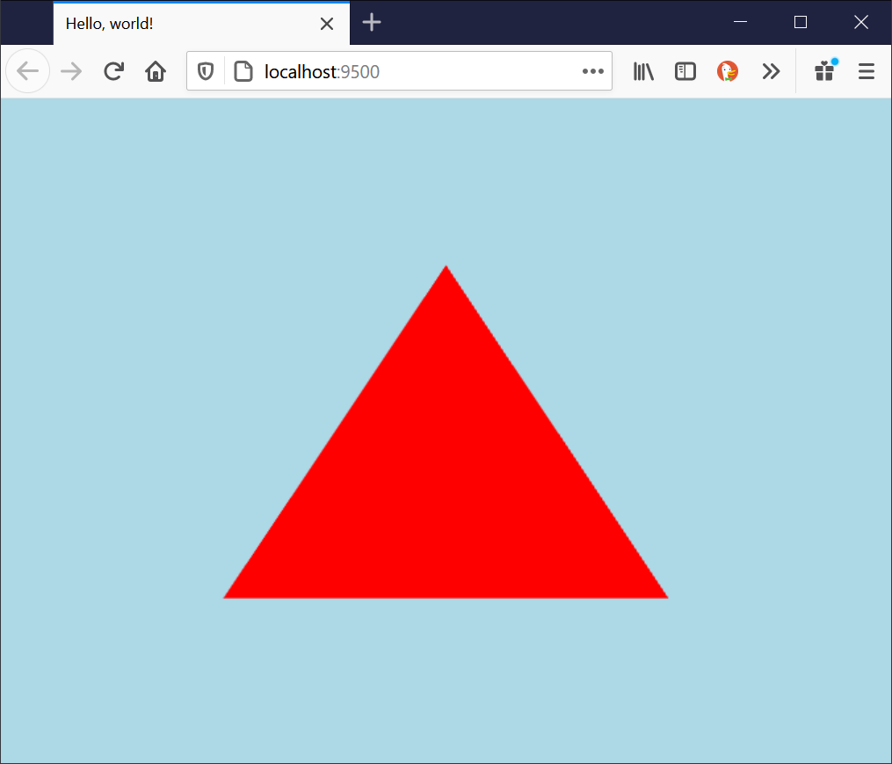
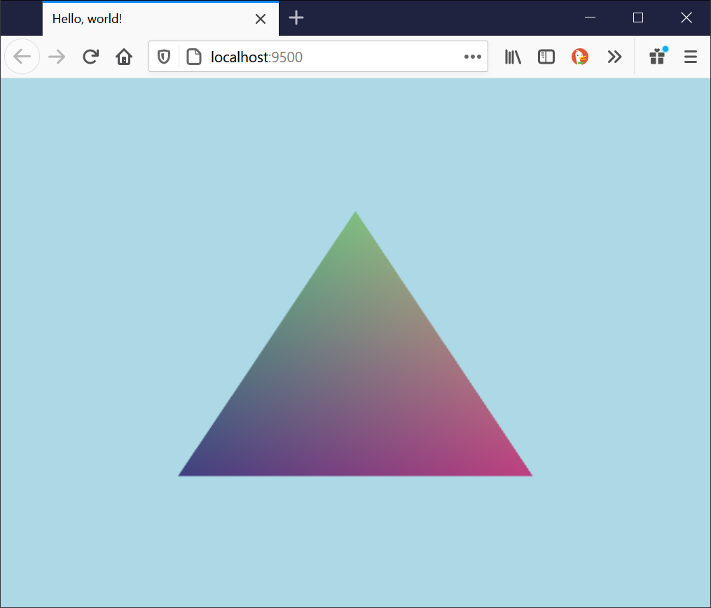

It is important to know that play-cljc is a relatively thin wrapper over OpenGL and WebGL. It gives you just enough structure to avoid error-prone boilerplate without losing low-level control. If you want to render *anything* beyond images and simple shapes, you will need to create your own entity.

Entities are maps that contain all the necessary OpenGL/WebGL state to render something, including shaders and the attributes/uniforms that are passed to them. This tutorial demonstrates how to make a custom entity that renders a triangle.

Some OpenGL/WebGL knowledge would help to understand this. I recommend [WebGL2 Fundamentals](https://webgl2fundamentals.org/) and [Learn OpenGL](https://learnopengl.com/) to learn more.

To begin, create a new project with this command:

`clj -Sdeps "{:deps {leiningen/leiningen {:mvn/version \""2.9.0\""}}}" -m leiningen.core.main new play-cljc hello-triangle`

Now `cd` into `hello-triangle` and make sure you can run it with `clj -M:dev`. It will open in your default browser. Now completely replace `src/hello_triangle/core.cljc` with the following:

```clojure
(ns hello-triangle.core
  (:require [hello-triangle.utils :as utils]
            [play-cljc.gl.core :as c]
            [play-cljc.gl.entities-2d :as e]
            [play-cljc.transforms :as t]
            #?(:clj  [play-cljc.macros-java :refer [gl math]]
               :cljs [play-cljc.macros-js :refer-macros [gl math]])))

(defonce *state (atom {}))

(defn init [game]
  ;; allow transparency in images
  (gl game enable (gl game BLEND))
  (gl game blendFunc (gl game SRC_ALPHA) (gl game ONE_MINUS_SRC_ALPHA))
  ;; create entity
  )

(defn tick [game]
  (let [game-width (utils/get-width game)
        game-height (utils/get-height game)]
    (c/render game
      {:viewport {:x 0 :y 0 :width game-width :height game-height}
       :clear {:color [(/ 173 255) (/ 216 255) (/ 230 255) 1] :depth 1}})
    ;; render entity
    )
  ;; return the game map
  game)
```

Now when you run `clj -M:dev`, it should just show a light blue background. Note that this command starts figwheel so you don't need to continuously re-run it -- it will reload your code automatically when you edit it.

We'll start by using the built-in `TwoDEntity` to draw a triangle. We'll need to define three sets of (x, y) vertices as a constant. Put this somewhere near the top of `src/hello_triangle/core.cljc`:

```clojure
(def vertices
  [-0.5 -0.5
    0.5 -0.5
    0.0  0.5])
```

In your `init` function, call `e/->entity` with the `vertices`. This will return an uncompiled entity, meaning that it isn't ready to render yet. Set its color to red and then `compile` it to create the `entity`:

```clojure
(defn init [game]
  ;; allow transparency in images
  (gl game enable (gl game BLEND))
  (gl game blendFunc (gl game SRC_ALPHA) (gl game ONE_MINUS_SRC_ALPHA))
  ;; create entity
  (swap! *state assoc :entity
    (c/compile game
       (-> (e/->entity game vertices)
           (t/color [1 0 0 1])))))
```

Lastly, simple `render` it in the `tick` function:

```clojure
(defn tick [game]
  (let [game-width (utils/get-width game)
        game-height (utils/get-height game)
        {:keys [entity]} @*state]
    (c/render game
      {:viewport {:x 0 :y 0 :width game-width :height game-height}
       :clear {:color [(/ 173 255) (/ 216 255) (/ 230 255) 1] :depth 1}})
    ;; render entity
    (c/render game entity))
  ;; return the game map
  game)
```

We now have a triangle!

<p align="center">
  
</p>


If we want to go beyond a single color, we need to make a custom entity so we can make our own shaders. First, define the shaders:


```clojure
(def vertex-shader
  '{:inputs {a_position vec2}
    :outputs {v_color vec4}
    :functions "
void main()
{
    gl_Position = vec4(a_position.x, a_position.y, 0.0, 1.0);
    v_color = gl_Position * 0.5 + 0.5;
}"
    })

(def fragment-shader
  '{:precision "mediump float"
    :inputs {v_color vec4}
    :outputs {o_color vec4}
    :functions "
void main()
{
    o_color = v_color;
}"
    })
```

If you want, you can optionally write your functions with Clojure data instead of GLSL strings. See [the iglu docs](https://oakes.github.io/iglu/) for more.

We're now ready to create the constructor function for this entity. Notice that we are creating an attribute map, which will know what data type it will be holding (float) and the size of each vertex.

```clojure
(defn ->triangle-entity [game]
  {:vertex vertex-shader
   :fragment fragment-shader
   :attributes {'a_position {:data vertices
                             :type (gl game FLOAT)
                             :size 2}}
   :uniforms {}})
```

Initialize the entity in the `init` function.

```clojure
(defn init [game]
  ;; allow transparency in images
  (gl game enable (gl game BLEND))
  (gl game blendFunc (gl game SRC_ALPHA) (gl game ONE_MINUS_SRC_ALPHA))
  ;; create entity
  (swap! *state assoc :entity
    (c/compile game
       (->triangle-entity game))))
```

You should now see a triangle with a nice-looking gradient:

<p align="center">
  
</p>
